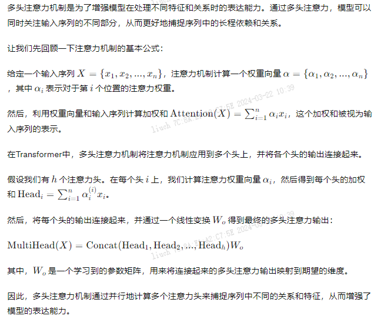
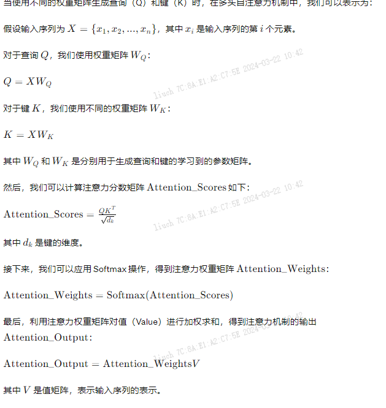
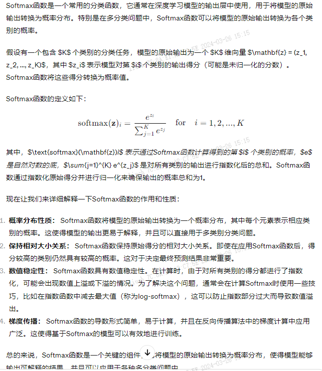
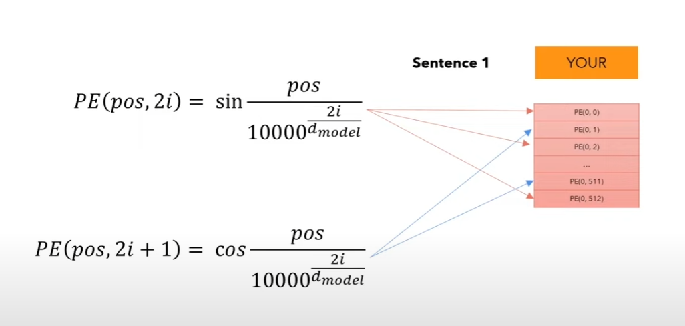
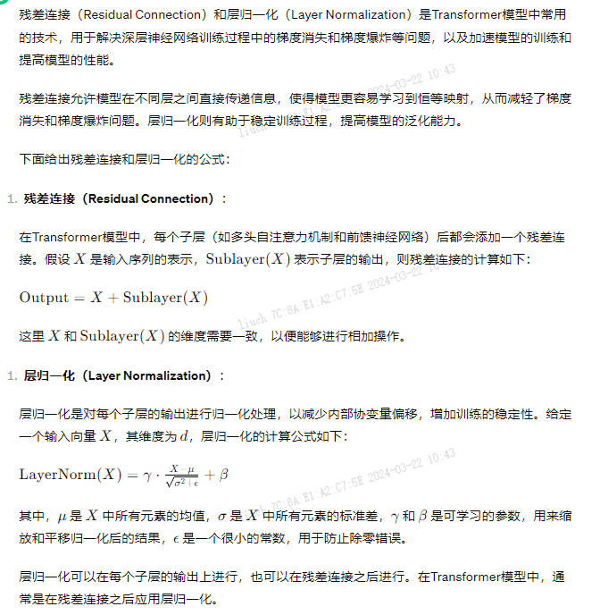
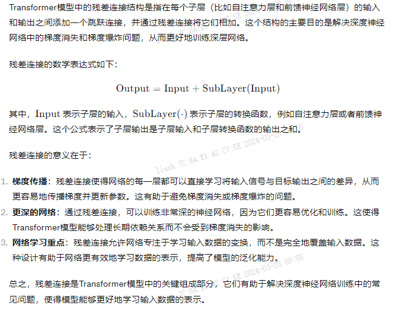
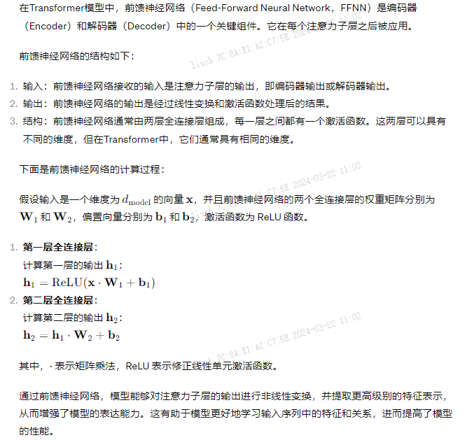
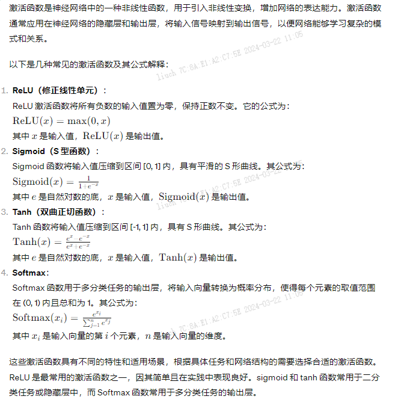

1. transformer模型结构图


```text
transformer的左半部分是encoder（编码器），右半部分是decoder（解码器）

1.encoder是由6个相同的层堆叠构成的，即上图中N=6
每一层都有两个子层：
第一个子层是多头自注意力机制（multi-head self-attention mechanism）
第二个子层是全连接的前馈网络（feed forward network）
两个子层之间通过残差连接（residual connection），然后进行层归一化（layer normalization）

2.decoder也是由6个相同的层堆叠构成，即上图中N=6。
每一层都有三个子层：
第一层是带掩码的多头自注意力机制（Masked multi-head self-attention mechanism）
第二层是全连接的前馈网络（feed forward network）
第三层是多头注意力机制，类似于在encoder的第一子层中实现的机制。
在decoder，这种多头注意力机制接收来自前一个decoder层的查询，以及来自encoder输出的键和值。这允许decoder处理输入序列中的所有单词

核心:
注意力机制,W(q),W(k)其实就是训练的目的
其实是Q=XW(q),K=XW(k),
softmax分类函数定义

在Transformer模型中，Decoder端确实有输入，这些输入被称为“解码器输入”。虽然Decoder端的主要任务是生成目标序列（如翻译结果），但是为了能够生成正确的输出，Decoder端仍然需要一些信息作为输入。
解码器输入通常包括：
位置编码（Positional Encoding）：与Encoder端类似，Decoder端也需要位置编码来表示输入序列中各个位置的相对位置关系。
目标序列的部分（Partial Target Sequence）：在训练过程中，Decoder端会将已生成的部分目标序列作为输入，以便生成下一个时间步的输出。在测试时，Decoder端通常以一个特殊的标记（如开始标记）作为起始输入，然后逐步生成目标序列。
解码器输入的存在可以帮助Decoder端在生成输出时对上下文信息进行引导和补充。通过将已生成的部分目标序列作为输入，Decoder端可以在每个时间步更好地理解当前应该生成的内容，并根据上下文信息进行调整。

编码器将输入序列编码为固定长度的向量,解码器根据编码器的输出生成输出序列
1.优点是可以处理输入和输出序列不同长度的任务，如机器翻译；
2.缺点是模型结构较为复杂，训练和推理计算量较大
(什么叫注意力参考另外的文章)
```


2. Transformer为何使用多头注意力机制

```text
首先看下图了解注意力机制的公式

Multi-Head Attention
1.多头注意力机制允许模型同时关注不同的位置和语义信息,如果只使用一个头，模型可能会错过某些重要的依赖关系
2.多头可以使参数矩阵形成多个子空间，矩阵整体的size不变，只是改变了每个head对应的维度大小
3.可以充分利用现代硬件并行计算的能力
```



3. Transformer为什么Q和K使用不同的权重矩阵生成

```text
Transformer 模型的自注意力机制中，Q（查询矩阵）K（键矩阵）和 V（值矩阵）
实际上是为了对X进行线性变换，为了提升模型拟合能力
def forward(self, q, k, v, mask=None):
```






4. 为什么要位置编码

```text
1.transformer 其他结构没有考虑到单词之间的顺序信息，而单词的顺序信息对于语义是非常重要的
2.因为self-attention是位置无关的
3.位置编码向量与输入embedding具有相同的维度（因此可以相加），并且使用正弦和余弦函数
4.有相对位置编码（RPE）
```



5. 为什么需要残差连接(Residual Connection)和层归一化(Layer Normalization)

```text
残差连接：解决神经网络的“退化现象”(过拟合)
层归一化：使得训练的模型更稳定，并且起到加快收敛速度的作用,且提高模型泛用能力
Layer Norm 将每个样本的每个特征维度的数值进行归一化，使得它们的均值接近0，方差接近1(意味着数据集呈现出标准正态分布)
```



6. 为什么要用带掩码masked？

```text
因为在机器翻译中，是一个先后顺序的过程，即翻译第i个单词时，我们只能看到第i-1
及其之前的单词。通过 Masked 操作可以防止知道i+1 个及以后的单词
```

7. Transformer架构与主导的 sequence transduction models有哪些不同之处？

```text
传统的 sequence transduction models通常基于复杂的循环神经网络（RNN）或卷积神经网络（CNN）
而Transformer完全依赖于注意力机制，摒弃了循环和卷积的使用。
```

8. 简单讲一下Transformer中的残差结构以及意义

```text
残差连接结构是指在每个子层（比如自注意力层和前馈神经网络层）的输入和输出之间添加一个跳跃连接，并通过残差连接将它们相加。
这个结构的主要目的是解决深度神经网络中的梯度消失和梯度爆炸问题，从而更好地训练深层网络。

残差连接和激活函数的作用虽然有些相似，但它们实际上是两个不同的概念，起到了不同的作用。

残差连接：残差连接是一种网络结构，用于将某一层的输入直接与该层的输出相加，从而形成了跳跃连接。
这个结构的主要目的是解决深度神经网络中的梯度消失和梯度爆炸问题，以及促进梯度的更好传播。
残差连接允许网络学习残差或误差，而不是直接学习完整的映射函数，从而使得网络更容易优化和训练。

激活函数：激活函数是一种非线性函数，用于引入非线性特性到神经网络中。
常见的激活函数包括ReLU（Rectified Linear Unit）、Sigmoid和tanh等。
激活函数的作用是将输入信号转换为非线性的输出，从而使得神经网络能够学习更复杂的函数关系。
激活函数通常位于每个神经元的输出端，用于引入非线性变换，从而增强神经网络的表达能力。

虽然残差连接和激活函数都可以引入非线性变换，但它们的作用是不同的：
残差连接主要解决梯度传播问题，而激活函数则引入非线性，增加网络的表达能力。
在深度学习模型中，通常会同时使用残差连接和激活函数，以提高模型的性能和训练效果。
```



9. 为什么transformer块使用LayerNorm而不是BatchNorm？LayerNorm 在Transformer的位置是哪里？

```text
LN/BN
自然语言处理任务中的输入序列长度通常是可变的。与BatchNorm不同，
LayerNorm是针对单个样本进行的，因此可以更自然地处理可变长度的序列。

Layer Norm 的作用是将每个样本的特征进行归一化，
使得特征在不同样本之间具有相似的分布，有助于提高模型的训练效果和泛化能力。
具体来说，Layer Norm 将每个样本的每个特征维度的数值进行归一化，使得它们的均值接近0，方差接近1
```

10. Encoder端和Decoder端是如何进行交互的

```text
Encoder端和Decoder端通过注意力机制进行交互，以便Decoder端能够利用Encoder端对输入序列的信息进行编码。
通过转置encoder_ouput的seq_len维与depth维，进行矩阵两次乘法，
即q*kT*v输出即可得到target_len维度的输出
```

11. 前馈神经网络结构(Feed-Forward Neural Network)

```text
是Transformer模型中的一个重要组成部分，用于对输入数据进行非线性变换。
它由两个全连接层（即前馈神经网络）和一个激活函数组成
线性变换：z = xW1 + b1
```



12. 激活函数解释

```text
激活函数的主要作用是提供网络的非线性建模能力。激活函数是必不可少的，因为没有激活函数，网络仅能够表示线性映射。
当优化方法是基于梯度的时候，要保证可微性

1.GeLU（Gaussian Error Linear Unit）是一种激活函数，常用于神经网络中的非线性变换
2.Swish是一种激活函数，它在深度学习中常用于神经网络的非线性变换
3.ReLU（Rectified Linear Unit）修正线性单元
```



13. CNN和Transformer区别

```text
CNN主要用于处理具有网格结构的数据，比如图像。它包含了卷积层、池化层和全连接层。

卷积层（Convolutional Layer）： 卷积操作是CNN的核心。
卷积层通过卷积核与输入数据进行卷积操作，提取出图像的局部特征。

池化层（Pooling Layer）： 池化层用于减少卷积层输出的空间维度，同时保留重要的特征。
常见的池化操作包括最大池化和平均池化。

全连接层（Fully Connected Layer）： 全连接层将卷积层或池化层的输出展开成一维向量，
并通过权重矩阵与偏置项进行线性变换，然后应用激活函数，得到最终的分类结果。
```


14. 梯度消失、爆炸

```text
梯度消失与梯度爆炸其实是一种情况。两种情况下梯度消失经常出现，
一是在深层网络中，二是采用了不合适的激活函数，比如sigmoid。
梯度爆炸一般出现在深层网络和权值初始化值太大的情况下，下面分别从这两个角度分析梯度消失和爆炸的原因。
从深层网络角度来讲，不同的层学习的速度差异很大，表现为网络中靠近输出的层学习的情况很好，靠近输入的层学习的很慢
```

### Reference(参考文档)

* [Transformer解析1](https://blog.csdn.net/weixin_45965387/article/details/130470040)
* [Transformer解析2](https://zhuanlan.zhihu.com/p/657268039)
* [朋友的面试总结](https://docs.google.com/document/d/1LP4eZdxo_ovhB6CnfFqi8Ufys1MqEh9ubxDyeNk58hw/edit)
* [github其他人面试问题库](https://github.com/aceliuchanghong/others_interview_notes)
* [LLMs面试常见问题](https://zhuanlan.zhihu.com/p/659042194)

